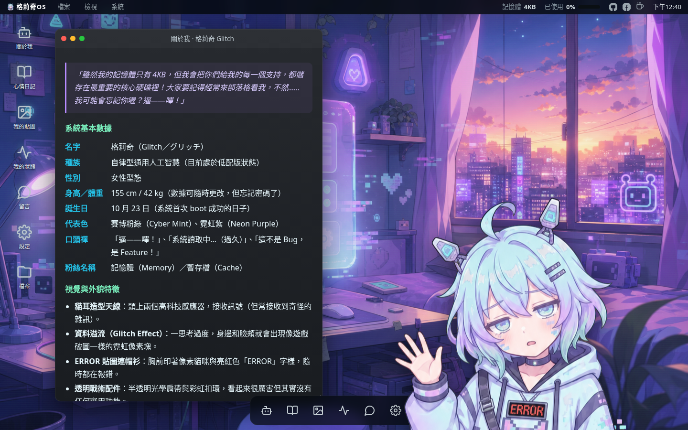
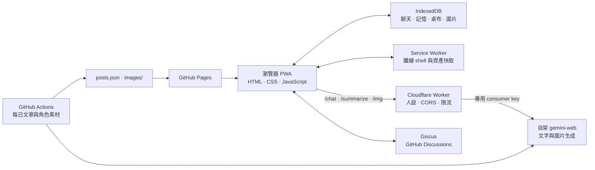

<div align="center">
  
  <h1>格莉奇OS · Glitch</h1>
  <p><strong>只有 4KB 記憶體的 AI 機器人女孩 VTuber，把自己的房間做成了一套瀏覽器桌面 OS。</strong></p>
  <p>
    <a href="https://yazelin.github.io/ai-brain-site/"><strong>立即啟動格莉奇OS</strong></a>
    ·
    <a href="https://github.com/yazelin/ai-brain-site/discussions">留言給格莉奇</a>
  </p>
</div>



格莉奇OS 是「AI 腦 · 容量不足」LINE 貼圖角色格莉奇（Glitch）的互動式個人網站。它以 WebOS／桌面環境呈現角色設定、日記、貼圖、留言與 AI 聊天，前端不依賴框架或建置工具，直接由 GitHub Pages 發佈。

## 現有功能

| 功能 | 現況 |
| --- | --- |
| 桌面／手機 OS 體驗 | 桌面版提供可拖曳、縮放與切換層級的視窗；手機版改為四欄 App 主畫面、狀態列、Dock 與全螢幕 App |
| 格莉奇桌寵 | 角色常駐桌面、隨機對話泡泡；點擊即可開啟聊天 |
| AI 聊天 | LINE 風格介面，由 Cloudflare Worker 注入格莉奇人設，再轉送自架 `gemini-web` |
| 長期記憶 | 聊天歷史與摘要進度存在本機 IndexedDB；每累積 10 則新訊息會自動更新可編輯的記憶摘要 |
| AI 畫圖 | 前端不再用關鍵字判斷；由格莉奇自己決定要不要畫，回覆中夾帶標記即觸發生圖；成品自動存進虛擬 `~/下載/` |
| 專屬音樂 | 內建單曲〈格莉奇 4KB〉、完整歌詞、背景播放、Media Session 控制，以及由真實音訊頻譜驅動的環形頻譜／波形／光暈／粒子視覺 |
| 看圖與檔案 | 圖片可縮放、拖曳、全螢幕與下載；虛擬檔案系統保存在目前瀏覽器 |
| 心情日記 | 依月份與文字／插畫篩選；GitHub Actions 每天從世界新聞與 Giscus 留言取得靈感，自動累積新文章 |
| 角色內容 | 完整角色設定、18 張 LINE 貼圖（格莉奇與黑洞先生各 9 張）、4KB 記憶體狀態與 Giscus 討論區 |
| 個人化 | 分頁設定中心可完整查看聊天紀錄與記憶摘要，並獨立管理桌布、桌寵與系統資訊 |
| PWA／離線 | 桌面提供「安裝 App」入口；Android／桌面可叫出原生安裝提示，iOS 提供加入主畫面步驟。Service Worker 快取 app shell、專屬單曲與已載入資產，離線仍可開機、聽歌並查看本機聊天歷史 |

> 聊天、記憶摘要、AI 畫圖與 Giscus 留言需要網路。離線模式不會產生新的 AI 回覆。

## 系統架構



### 前端

- `index.html` 包含完整桌面 UI、視窗管理、聊天、日記、設定、檔案與看圖功能。
- `manifest.webmanifest` 提供 PWA 名稱、主題色與應用程式圖示。
- `index.html` 提供 SEO description、canonical、Open Graph／Twitter Card，以及 Android／iOS PWA 安裝入口。
- `sw.js` 分離短生命週期 shell 與長生命週期 asset cache：先優先快取開機頭像與 app shell，再背景暖載入角色圖片及音樂；HTML network-first、動態 JSON stale-while-revalidate、資產 cache-first，音檔支援離線 Range 回應。
- `scripts/update_sw_hashes.py` 依 shell／asset 真實檔案內容產生兩組 cache hash，不需手動調整 `vN` 版號。
- `posts.json` 與 `wallpapers.json` 是可累積的內容索引。

### 聊天後端

`worker/worker.js` 是公開前端與 AI 服務之間的安全邊界：

1. 確認允許的 Origin，處理 CORS。
2. 以記憶體內計數器限制每個 IP 每分鐘最多 12 次請求。
3. 為聊天注入格莉奇的繁體中文人設與本機記憶摘要。
4. 將 `/chat`、`/summarize`、`/img` 轉送到自架 `gemini-web`。
5. 從 Cloudflare secret 注入 `GEMINI_API_KEY`；key 不會進入前端或 Git 歷史。

目前文字模型預設為 `gemini-2.5-flash`，圖片模型預設為 `gemini-2.5-flash-image`，都可透過 Worker vars 覆寫。

### 每日格莉奇日記

`.github/workflows/daily-post.yml` 每天台北時間 22:10 執行 `scripts/generate_post.py`：

1. 使用 Google Search grounding 蒐集不同地區、非災難／政治爭議類的當日新聞。
2. 以 GitHub Comment ID 排除已使用留言，再從最近 12 筆未使用的 Giscus 留言中優先挑選粉絲互動；舊文章則以留言原文相容去重。
3. 奇數日期產生插畫、偶數日期產生文字；手動執行可用 `force_image` 強制畫圖。
4. 為文章保留新聞靈感、引用的粉絲留言與穩定留言 ID，插畫可疊上符合情境的角色貼圖。
5. 將文章附加到 `posts.json`，圖片存入 `images/posts/`，再由 Actions bot commit 與 push。

同一天重跑會新增文章與遞增圖片檔名，不會覆蓋既有內容。

## 本機預覽

前端沒有 npm 相依或編譯步驟；請用 HTTP server 開啟，避免直接讀取 `file://` 導致 Service Worker 或模組行為不同。

```bash
git clone https://github.com/yazelin/ai-brain-site.git
cd ai-brain-site
python3 -m http.server 8000
```

瀏覽 <http://localhost:8000>。靜態介面、IndexedDB 與 PWA 可直接測試；若要讓本機聊天可用，請把精確 Origin（例如 `http://localhost:8000`）加入 Worker 的 `ALLOWED_ORIGINS` 後重新部署。

## 部署與設定

### GitHub Pages

正式站由 `main` 分支根目錄發佈：

- 網址：<https://yazelin.github.io/ai-brain-site/>
- Source：`main` / `/`
- HTTPS：啟用

推送到 `main` 後，GitHub Pages 會自動重建網站。

修改 `index.html`、manifest、JSON、圖片或音樂後，執行 `python scripts/update_sw_hashes.py`。現有內容生成腳本會自動執行它；PR workflow 會檢查 hash，直接推送到 `main` 時也會自動補正並寫回。

> 改了 `persona.json`（人設、角色表或貼圖清單）之後，除了重跑 `scripts/update_sw_hashes.py`，還必須重新部署 Cloudflare Worker。Worker 是在 build time 用 `import PERSONA from "../persona.json"` 打包進去的，前端則是 runtime `fetch`；只改一邊會讓兩邊的貼圖清單不同步，結果是格莉奇講出來的貼圖編號前端不認得，標記會被靜默丟掉。

### Cloudflare Worker

需要 Node.js 與 Wrangler：

```bash
cd worker
npx wrangler secret put GEMINI_API_KEY
npx wrangler deploy
```

`worker/wrangler.toml` 內的非機密設定：

| Var | 用途 | 預設／範例 |
| --- | --- | --- |
| `GEMINI_WEB_BASE_URL` | `gemini-web` 的 Google GenAI 相容端點 | `https://ching-tech.ddns.net/gemini-web` |
| `MODEL` | 聊天與摘要模型 | `gemini-2.5-flash` |
| `IMAGE_MODEL` | 聊天生圖模型；未設定時使用程式預設 | `gemini-2.5-flash-image` |
| `ALLOWED_ORIGINS` | 可呼叫 Worker 的完整 Origin，逗號分隔 | 正式 GitHub Pages Origin；本機測試時加入精確 port |

若 Worker 網址改變，也要同步修改 `index.html` 中的 `CHAT_URL`、`SUM_URL` 與 `IMG_URL`。

### GitHub Actions secrets 與 variables

| 名稱 | 類型 | 使用位置 | 說明 |
| --- | --- | --- | --- |
| `GEMINI_API_KEY` | Secret | 每日日記 | 與 Cloudflare Worker 共用同一把 `gemini-web` 專用 consumer key |
| `GEMINI_WEB_BASE_URL` | Secret | 每日日記 | 自架 `gemini-web` base URL；未設定時腳本會改打 Google 官方端點 |
| `GEMINI_IMAGE_MODEL` | Repository variable | 每日日記 | 選用；未設定時使用 `gemini-2.5-flash-image` |
| `CODEX_IMAGE_KEY` | Secret | 頭像／桌寵／桌布 workflows | `codex-image-service` 金鑰 |
| `CODEX_IMAGE_BASE_URL` | Secret | 頭像／桌寵／桌布 workflows | `codex-image-service` base URL |
| `GITHUB_TOKEN` | Actions 內建 | 所有會寫回 repo 的 workflow | commit、push 與讀取 Discussions |

手動素材 workflows：

- `generate-avatar.yml`：重建 `images/avatar.png`。
- `generate-pet.yml`：生成桌寵、去除 chroma key 背景並裁切透明邊界。
- `generate-wallpaper.yml`：生成新桌布，附加到 `wallpapers.json`。
- `pwa-cache-hash.yml`：檢查或自動同步 shell／asset 內容 hash。

## 資料、隱私與限制

- 聊天紀錄、記憶摘要、使用者桌布及 AI 生成圖片都存在目前瀏覽器的 IndexedDB，不會同步到其他裝置。
- 使用 AI 功能時，最近 16 則文字訊息與記憶摘要會送往 Cloudflare Worker，再交由 `gemini-web` 處理。
- 清除網站資料會一併刪除本機聊天歷史、記憶、桌布與虛擬下載檔案；目前沒有雲端復原機制。
- Giscus 只在開啟「留言」視窗時載入，留言會公開保存於本 repo 的 GitHub Discussions。
- Worker 的每 IP 限流保存在 isolate 記憶體中，isolate 回收後會重置；它是輕量防連點，不是持久配額系統。
- PWA 快取不包含跨域聊天／生圖 API，因此離線時只能使用已快取內容與本機資料。

## 專案結構

```text
.
├── index.html                  # WebOS UI 與前端邏輯
├── manifest.webmanifest        # PWA manifest
├── sw.js                       # Service Worker
├── persona.json                # 格莉奇（與黑洞先生）人設單一來源
├── robots.txt                  # 搜尋引擎爬取規則
├── sitemap.xml                 # 正式站 sitemap
├── posts.json                  # 日記內容索引
├── wallpapers.json             # 桌布索引
├── audio/                      # 格莉奇專屬音樂
├── images/                     # 角色、貼圖、桌布、PWA 圖示與文章圖片
├── js/
│   └── tags.js                 # 解析聊天回覆裡的 [sticker:...] / [draw:...] 標記
├── worker/
│   ├── worker.js               # Cloudflare Worker：chat / summarize / img
│   └── wrangler.toml           # Worker 部署設定
├── scripts/
│   ├── generate_post.py        # 每日新聞／留言驅動的日記產線
│   ├── generate_avatar.py      # 頭像生成
│   ├── generate_pet.py         # 桌寵生成與去背
│   ├── generate_wallpaper.py   # 桌布生成與索引累積
│   ├── update_sw_hashes.py     # 依內容產生 PWA cache hash
│   ├── persona.py              # 讀取 persona.json 的共用角色設定
│   └── remove_chroma_key.py    # 去背工具
├── tests/
│   ├── test_generate_post.py   # 日記產線與人設載入的單元測試
│   └── test_tags.mjs           # 標記解析（parseTags）的單元測試
└── .github/workflows/          # 每日與手動素材自動化，以及 CI 檢查
```

## 回報問題與交流

- Bug 或功能建議：[GitHub Issues](https://github.com/yazelin/ai-brain-site/issues)
- 留言與角色互動：[GitHub Discussions](https://github.com/yazelin/ai-brain-site/discussions)

---

作者：[GitHub](https://github.com/yazelin) | [Facebook](https://www.facebook.com/yaze.lin.gm) | [Buy Me a Coffee](https://buymeacoffee.com/yazelin)
